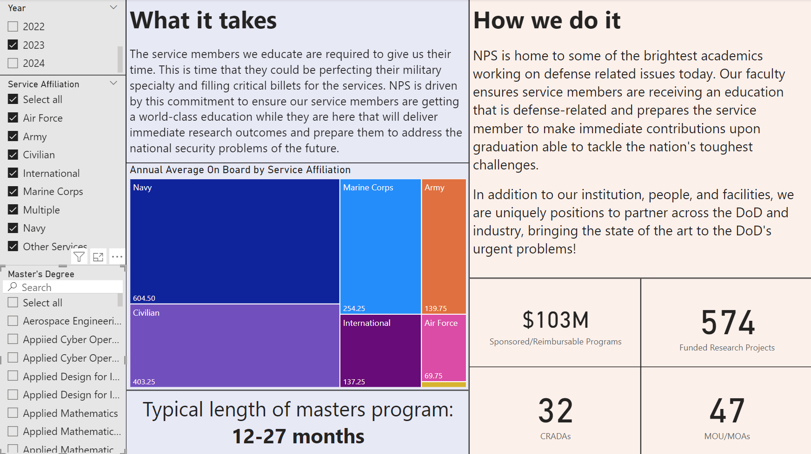
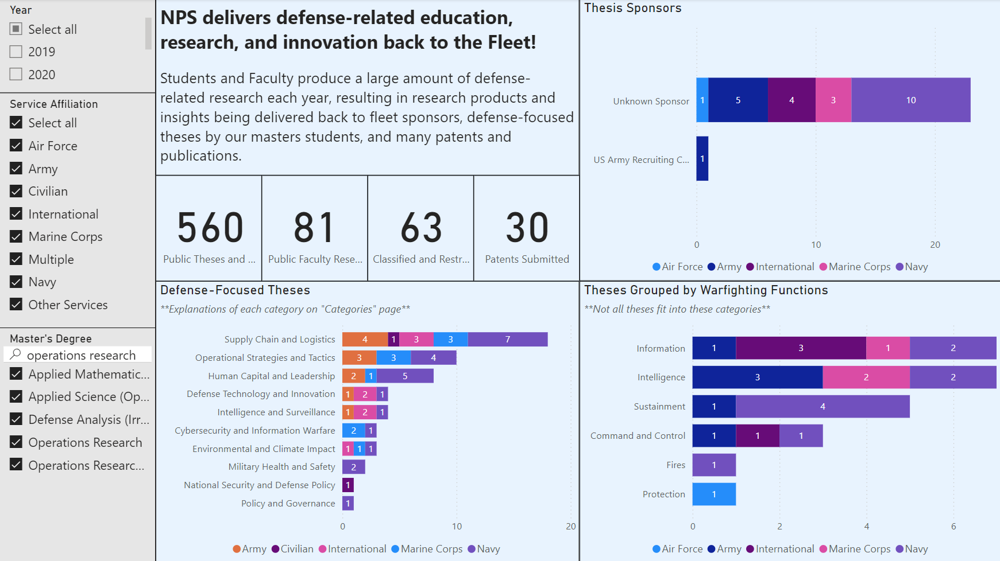
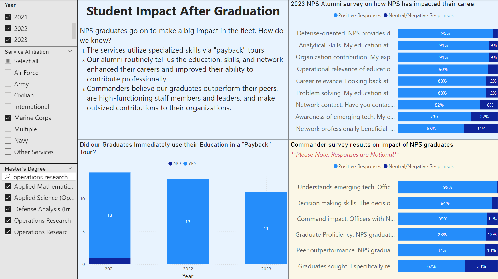

# Investigating Naval Postgraduate School (NPS) Return on Investment (ROI) to the Joint Services

This repository holds material used to satisify the course requirements for [OA4820 - Case Studies in Applied Defense Analytics](https://nps.smartcatalogiq.com/en/current/academic-catalog/courses/oa/4000/oa4820/). The specific project for this team was investigating new methods and metrics that NPS leadership can use to assess and communicate the ROI an NPS offers to the DOD. A specific use case of such methods and metrics would be in the course of negotiating DOD budget appropiations to the school and what outputs here are able to reasonably convey to senior budget decision makers why a graduate degree at NPS is worth the joint services sending mid-grade officers here for 12 to 24 months, away from their primary military specialty and at a cost to the DOD. This is a large problem with many avenues of approach and this repository will hold our findings and basic methodolgy used. All data used in the project is left out of this project, with the assumption being relevant persons for this work already have the data. 

## How to use repo

Code we used for text analysis and service utilization in the "Code" folder (2 jupyter notebooks and 1 R script). Additionally, our final brief slideshow and technical report are saved here for review describing the project in more detail.

## Results of project

As outlined in the final briefing and technical report, we created a dashboard that attempts to convey value of NPS using selected metrics to show how students are delivering products back to the fleet while here in highly relevant research areas while also showing that NPS graduates go onto utilization/payback tours that have high impact in their source services while also showing positive value delivery back to fleet using results from alumni (real) and commander (notional) survey results. Below are 2 screenshots from our Power BI dashboard that takes in all the data we acquired for this project and attempts to tell the story of ROI for an NPS degree.

### Key inputs to NPS

### Key outputs while at NPS

### Key outcomes for services after NPS

## Notes on course

This course primary serves as the capstone course for the [Operational Data Science and Statistical Machine Learning certificate (Curriculum 269)](https://nps.smartcatalogiq.com/en/current/academic-catalog/departments/department-of-operations-research/operational-data-science-and-statistical-machine-learning-curriculum-269/). Most students who complete this certificate and this capstone course are also working toward a [Masters of Science in Operations Research (Curriculum 360 and 361)](https://nps.edu/web/or/operations-analysis-360). 
